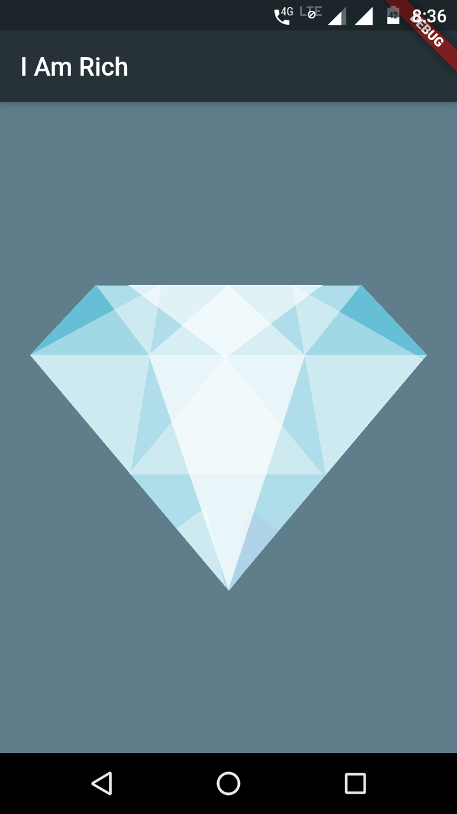

# I-am-Rich--master
I am Rich
Have you heard about an app that had the name I am rich which was priced at around $999 and literally did nothing other than showing a pic of a ruby. I've tried to replicate the same using flutter and it's the first app I've made using flutter.

Getting Started
A few resources to get you started if this is your first Flutter project:

Screenshot of application

